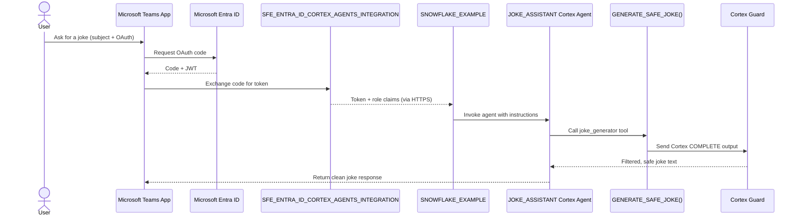

# Auth Flow - Snowflake Cortex Agents for Microsoft Teams
Author: Michael Whitaker 
Last Updated: 2025-11-13 
Status: Reference Impl

Reference Impl: This code demonstrates prod-grade architectural patterns and best practice. review and customize security, networking, logic for your organization's specific requirements before deployment.
## Overview
This sequence diagram traces Teams user authentication through Microsoft Entra ID, the SFE_ENTRA_ID_CORTEX_AGENTS_INTEGRATION, and the JOKE_ASSISTANT agent that calls the Cortex-enabled SQL function.
## Diagram

## Component Descriptions
- Microsoft Teams App: Serves as the client UI that initiates OAuth, sends prompts, and renders responses (docs/05-INSTALL-TEAMS-APP.md).
- Microsoft Entra ID: Authenticates users, enforces consent, and issues JWTs used by Snowflake (docs/02-ENTRA-ID-SETUP.md).
- SFE_ENTRA_ID_CORTEX_AGENTS_INTEGRATION: Handles the OAuth callback, maps JWT claims to Snowflake roles, and keeps the agent session within the account (sql/01_setup/04_create_security_integration.sql).
- SNOWFLAKE_EXAMPLE Account: Receives the validated session and routes requests to the agent within the secure Snowflake instance (sql/01_setup/01_create_demo_objects.sql).
- JOKE_ASSISTANT Cortex Agent: Orchestrates tool usage, enforces response instructions, and calls the SQL function via the `joke_generator` tool (sql/01_setup/03_create_cortex_agent.sql).
- GENERATE_SAFE_JOKE() Function: Wraps the Cortex COMPLETE call, casts the output, and exposes the joke text to the agent (sql/01_setup/02_create_joke_function.sql).
- Cortex Guard: Validates the AI output to ensure safe, workplace-appropriate responses before the agent returns text to Teams (sql/01_setup/02_create_joke_function.sql).
## Change History
See `.cursor/DIAGRAM_CHANGELOG.md` for vhistory.
