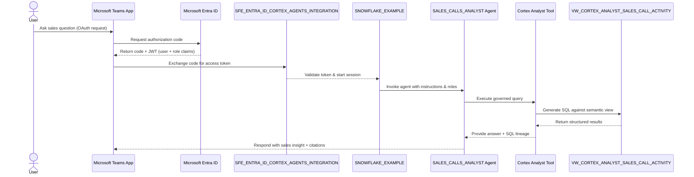

# Auth Flow - Snowflake Cortex Agents for Microsoft Teams

Author: SE Community  
Last Updated: 2025-12-02  
Expires: 2026-01-01 (30 days from creation)  
Status: Reference Implementation

Reference Implementation: This code demonstrates production-grade architectural patterns and best practices. Review and customize security, networking, and logic for your organization's specific requirements before deployment.
## Overview
This sequence diagram traces authentication and query execution from Teams through Microsoft Entra ID and the SFE_ENTRA_ID_CORTEX_AGENTS_INTEGRATION into Snowflake, where the SALES_CALLS_ANALYST agent invokes the Cortex Analyst tool over the governed sales-call semantic view.
## Diagram

## Component Descriptions
- Microsoft Teams App: Initiates OAuth, submits natural language questions, and renders agent responses (docs/05-INSTALL-TEAMS-APP.md).
- Microsoft Entra ID: Authenticates the user, enforces MFA/Conditional Access, and issues the JWT that Snowflake validates (docs/02-ENTRA-ID-SETUP.md).
- SFE_ENTRA_ID_CORTEX_AGENTS_INTEGRATION: Exchanges the authorization code for a token, maps claims to Snowflake roles, and launches the Snowflake session (sql/01_setup/04_create_security_integration.sql).
- SNOWFLAKE_EXAMPLE Account: Receives the authenticated session and routes requests to the agent and warehouse (sql/01_setup/01_create_demo_objects.sql).
- SALES_CALLS_ANALYST Cortex Agent: Governs the orchestration logic, chooses the Cortex Analyst tool, and enforces response formatting (sql/01_setup/03_create_cortex_agent.sql).
- Cortex Analyst Tool: Generates SQL over the semantic view, executes it in the governed warehouse, and returns structured results plus lineage metadata (sql/01_setup/03_create_cortex_agent.sql).
- VW_CORTEX_ANALYST_SALES_CALL_ACTIVITY: Semantic view that encapsulates distributor/manufacturer sales call metrics and ties back to curated fact tables (docs/08-TEAMS-INTEGRATION.md).
## Change History
See `.cursor/DIAGRAM_CHANGELOG.md` for vhistory.
