# Data Flow - Snowflake Cortex Agents for Microsoft Teams
Author: Michael Whitaker
Last Updated: 2025-11-14
Status: Reference Impl

Reference Impl: This code demonstrates prod-grade architectural patterns and best practice. review and customize security, networking, logic for your organization's specific requirements before deployment.
## Overview
This diagram shows how a Microsoft Teams prompt flows through Microsoft Entra ID, the shared SFE_ENTRA_ID_CORTEX_AGENTS_INTEGRATION, and into Snowflake where the SALES_CALLS_ANALYST agent queries the governed semantic view `VW_CORTEX_ANALYST_SALES_CALL_ACTIVITY` via Cortex Analyst before returning results to Teams.
## Diagram

```mermaid
graph LR
    Teams[Microsoft Teams<br/>AppSource client]
    Entra[Microsoft Entra ID<br/>OAuth issuer]
    Integration[SFE_ENTRA_ID_CORTEX_AGENTS_INTEGRATION<br/>External OAuth]

    subgraph Snowflake Account
        Agent[SALES_CALLS_ANALYST<br/>Cortex Agent]
        AnalystTool[sales_calls_analyst<br/>Cortex Analyst tool]
        Warehouse[SFE_CORTEX_AGENTS_WH<br/>Warehouse]
        SemanticView[VW_CORTEX_ANALYST_SALES_CALL_ACTIVITY<br/>Semantic View]
        FactTable[SNOWFLAKE_EXAMPLE.ANALYTICS.SALES_CALL_ACTIVITY<br/>Fact table]
    end

    Teams -->|OAuth request| Entra
    Entra -->|JWT + role claims| Integration
    Integration -->|Validated Snowflake session| Agent
    Agent -->|Invokes| AnalystTool
    AnalystTool -->|Executes SQL on| Warehouse
    AnalystTool -->|Runs governed query| SemanticView
    SemanticView -->|Selects from| FactTable
    Agent -->|Structured answer| Teams
```

## Component Descriptions
- Microsoft Teams App: Hosted in Teams / AppSource, this UI initiates prompts, handles OAuth redirects, and renders the agent’s answer (docs/05-INSTALL-TEAMS-APP.md).
- Microsoft Entra ID: Provides tenant consent, MFA, and short-lived JWTs that Snowflake consumes through the external OAuth integration (docs/02-ENTRA-ID-SETUP.md).
- SFE_ENTRA_ID_CORTEX_AGENTS_INTEGRATION: Account-level external OAuth object that validates JWTs and maps claims to Snowflake roles (sql/01_setup/04_create_security_integration.sql).
- SALES_CALLS_ANALYST Cortex Agent: Production-ready agent that orchestrates the Cortex Analyst tool using governed instructions (sql/01_setup/03_create_cortex_agent.sql, Option C).
- sales_calls_analyst Cortex Analyst Tool: Generates SQL against the semantic view and enforces data governance for Teams questions (sql/01_setup/03_create_cortex_agent.sql).
- VW_CORTEX_ANALYST_SALES_CALL_ACTIVITY: Curated semantic view that exposes distributor/manufacturer sales call metrics (docs/08-TEAMS-INTEGRATION.md).
- SNOWFLAKE_EXAMPLE.ANALYTICS.SALES_CALL_ACTIVITY: Fact table powering the semantic view; joins and filters execute inside Snowflake using the dedicated warehouse (docs/07-CUSTOMIZATION.md).
- SFE_CORTEX_AGENTS_WH Warehouse: XSMALL warehouse that executes Cortex Analyst queries so compute stays isolated and auto-suspended (sql/01_setup/01_create_demo_objects.sql).
- Cleanup Script: `sql/99_cleanup/teardown_all.sql` removes agent-specific schemas, roles, and warehouses while preserving shared integration objects.
## Change History
See `.cursor/DIAGRAM_CHANGELOG.md` for vhistory.
