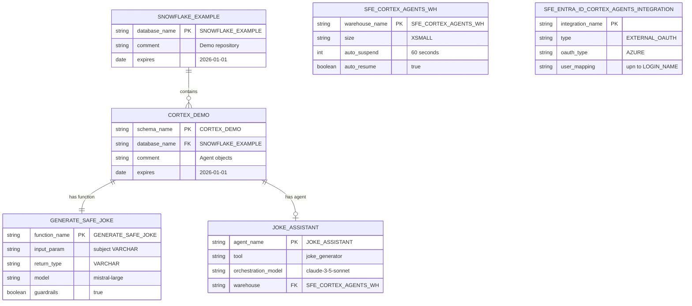
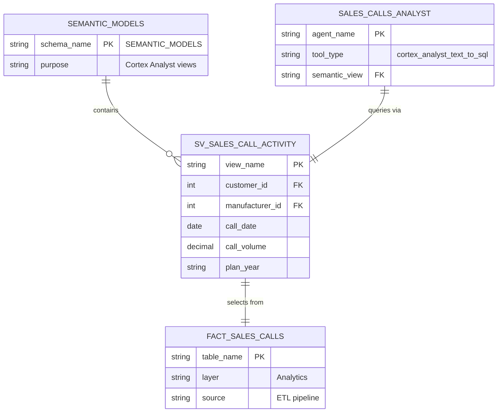

# Data Model - Snowflake Cortex Agents for Microsoft Teams

Author: SE Community  
Last Updated: 2025-12-02  
Expires: 2026-01-01 (30 days from creation)  
Status: Reference Implementation

Reference Implementation: This code demonstrates production-grade architectural patterns and best practices. Review and customize security, networking, and logic for your organization's specific requirements before deployment.

## Overview

This diagram shows the database schema and object relationships for the Cortex Agents Teams integration demo. The demo uses a minimal schema focused on the AI joke generation function and Cortex Agent configuration. For production analytics use cases, the semantic view pattern (shown in dashed lines) demonstrates how to connect existing governed data assets.

## Diagram

## Production Analytics Pattern (Optional)

For production use cases with semantic views:

## Component Descriptions

### Core Demo Objects

| Component | Purpose | Technology | Location |
|-----------|---------|------------|----------|
| SNOWFLAKE_EXAMPLE | Demo database namespace | Snowflake Database | Account-level |
| CORTEX_DEMO | Schema for agent objects | Snowflake Schema | `SNOWFLAKE_EXAMPLE.CORTEX_DEMO` |
| GENERATE_SAFE_JOKE | AI joke generation | SQL UDF + Cortex COMPLETE | `sql/01_setup/02_create_joke_function.sql` |
| JOKE_ASSISTANT | Cortex Agent for Teams | Cortex Agent | Created via UI/REST |
| SFE_CORTEX_AGENTS_WH | Compute for agent queries | Snowflake Warehouse | `sql/01_setup/01_create_demo_objects.sql` |
| SFE_ENTRA_ID_CORTEX_AGENTS_INTEGRATION | OAuth with Microsoft | Security Integration | `sql/01_setup/04_create_security_integration.sql` |

### Production Pattern Objects (Optional)

| Component | Purpose | Technology | Location |
|-----------|---------|------------|----------|
| SEMANTIC_MODELS | Schema for semantic views | Snowflake Schema | Customer database |
| SV_SALES_CALL_ACTIVITY | Governed analytics view | Semantic View | Customer schema |
| SALES_CALLS_ANALYST | Production analytics agent | Cortex Agent | `sql/01_setup/03_create_cortex_agent.sql` (Option C) |

## Data Types Reference

| Object Type | Naming Convention | Example |
|-------------|-------------------|---------|
| Database | UPPER_SNAKE_CASE | `SNOWFLAKE_EXAMPLE` |
| Schema | UPPER_SNAKE_CASE | `CORTEX_DEMO` |
| Function | UPPER_SNAKE_CASE | `GENERATE_SAFE_JOKE` |
| Warehouse | SFE_ prefix + purpose | `SFE_CORTEX_AGENTS_WH` |
| Integration | SFE_ prefix + type | `SFE_ENTRA_ID_CORTEX_AGENTS_INTEGRATION` |
| Semantic View | SV_ prefix + domain | `SV_SALES_CALL_ACTIVITY` |

## Change History

See `.cursor/DIAGRAM_CHANGELOG.md` for version history.

