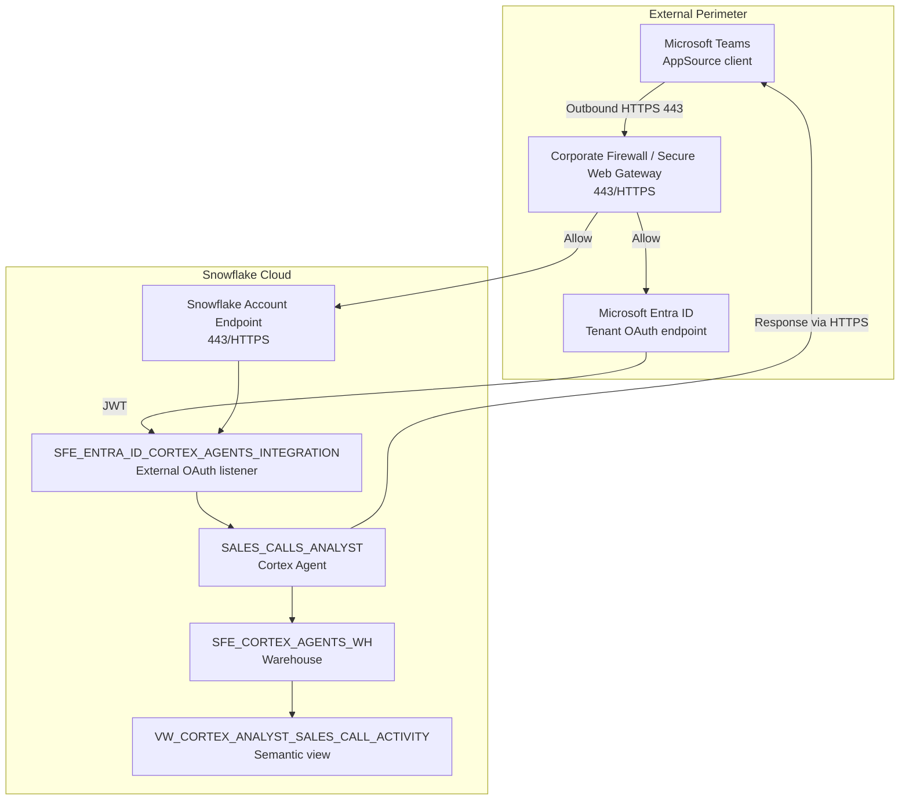

# Network Flow - Snowflake Cortex Agents for Microsoft Teams

Author: SE Community  
Last Updated: 2025-12-02  
Expires: 2026-01-01 (30 days from creation)  
Status: Reference Implementation

Reference Implementation: This code demonstrates production-grade architectural patterns and best practices. Review and customize security, networking, and logic for your organization's specific requirements before deployment.
## Overview
This network diagram traces the HTTPS paths between Microsoft Teams, Microsoft Entra ID, and the Snowflake account that hosts the SALES_CALLS_ANALYST agent. It highlights the external OAuth boundary, Lists open ports (443), and shows how traffic stays inside Snowflake once the agent executes Cortex Analyst queries.
## Diagram

## Component Descriptions
- Microsoft Teams App: Initiates HTTPS calls to Entra ID and Snowflake; traffic must be allowed through any corporate firewall or secure web gateway (docs/05-INSTALL-TEAMS-APP.md).
- Microsoft Entra ID: Handles OAuth consent and returns JWTs over HTTPS; accounts using network policies or Private Link must disable them for this integration (docs/02-ENTRA-ID-SETUP.md, docs/08-TEAMS-INTEGRATION.md).
- SFE_ENTRA_ID_CORTEX_AGENTS_INTEGRATION: Snowflake external OAuth integration that receives Entra ID tokens and starts the Snowflake session with mapped roles (sql/01_setup/04_create_security_integration.sql).
- Snowflake Account Endpoint: Public endpoint (port 443) where all agent traffic lands before it is routed internally (sql/01_setup/01_create_demo_objects.sql).
- SALES_CALLS_ANALYST Cortex Agent: Executes in Snowflake, orchestrates the Cortex Analyst tool, and keeps data resident within Snowflake’s governance boundary (sql/01_setup/03_create_cortex_agent.sql).
- SFE_CORTEX_AGENTS_WH Warehouse: Dedicated warehouse that runs the Cortex Analyst queries against the semantic view (sql/01_setup/01_create_demo_objects.sql).
- VW_CORTEX_ANALYST_SALES_CALL_ACTIVITY: Semantic view that exposes governed sales-call metrics; queries never leave Snowflake (docs/08-TEAMS-INTEGRATION.md, docs/07-CUSTOMIZATION.md).
## Change History
See `.cursor/DIAGRAM_CHANGELOG.md` for vhistory.
