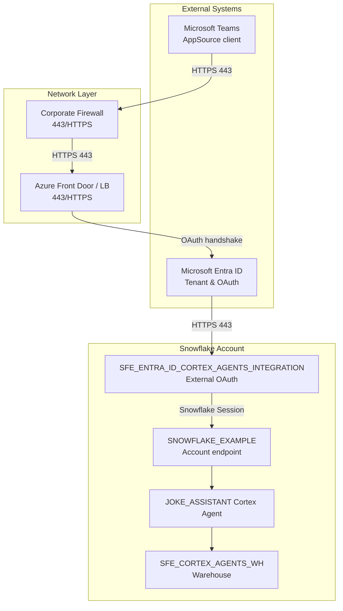

# Network Flow - Snowflake Cortex Agents for Microsoft Teams
Author: Michael Whitaker 
Last Updated: 2025-11-13 
Status: Reference Impl

Reference Impl: This code demonstrates prod-grade architectural patterns and best practice. review and customize security, networking, logic for your organization's specific requirements before deployment.
## Overview
Network-flow shows how Teams, Azure, and Snowflake components connect over HTTPS, emphasizes the shared SFE_ENTRA_ID_CORTEX_AGENTS_INTEGRATION boundary, and highlights the dedicated warehouse used by the agent.
## Diagram

## Component Descriptions
- Microsoft Teams App: Runs inside Teams and opens HTTPS tunnels for OAuth and agent conversations (docs/05-INSTALL-TEAMS-APP.md).
- Microsoft Entra ID: The identity provider that handles OAuth flows, consent, and token issuance (docs/02-ENTRA-ID-SETUP.md).
- Corporate Firewall & Azure Front Door: Represent the perimeter that must allow outbound HTTPS 443 to Entra ID and Snowflake; ensure network policies do not block the OAuth handshake.
- SFE_ENTRA_ID_CORTEX_AGENTS_INTEGRATION: Account-level API integration that owns the OAuth listener, maps claims, and enforces allowed roles (sql/01_setup/04_create_security_integration.sql).
- SNOWFLAKE_EXAMPLE Account Endpoint: The Snowflake account endpoint where the Cortex agent and SQL function execute (sql/01_setup/01_create_demo_objects.sql).
- JOKE_ASSISTANT Cortex Agent + Warehouse: Agent runs inside the Snowflake account and executes in the `SFE_CORTEX_AGENTS_WH` warehouse so that Cortex COMPLETE and Cortex Guard stay within the secure compute layer (sql/01_setup/03_create_cortex_agent.sql, sql/01_setup/01_create_demo_objects.sql).
## Change History
See `.cursor/DIAGRAM_CHANGELOG.md` for vhistory.
